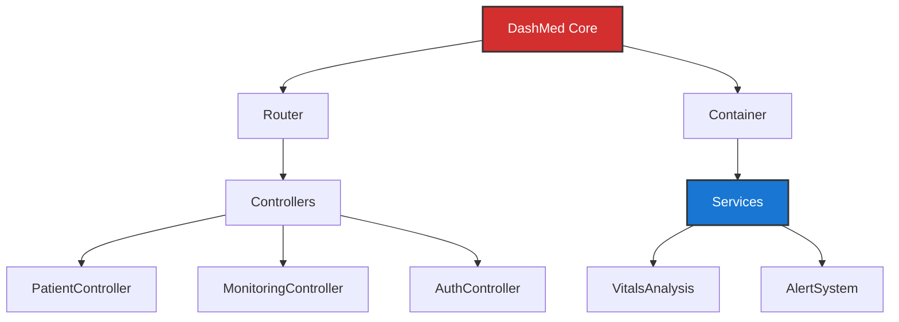

<div align="center">

  <h1>🩺 DashMed</h1>
  <h3>Intelligent ICU Dashboard / Tableau de Bord Intelligent de Réanimation</h3>
  <h4>Hôpital des Armées de Toulon — Service de Réanimation</h4>
  
  <p>
    <b>A mission-critical, secure, and adaptive system for intensive care unit management.</b>
  </p>
  <p>
    Un système critique, sécurisé et adaptatif pour la gestion du service de réanimation.
  </p>

  <p>
    <a href="https://php.net">
      
    </a>
    <a href="https://mysql.com">
      
    </a>
    <a href="https://getcomposer.org">
      
    </a>
    <a href="LICENSE">
      
    </a>
  </p>
</div>

---

## 📖 Mission & Context / Mission & Contexte

**DashMed** is an specialized medical platform developed for the **Intensive Care Unit (ICU) of the Toulon Military Hospital**. Unlike generic hospital systems, DashMed is designed to be **context-aware**, adapting its interface and data prioritization based on the department's operational status (Normal, Crisis, Mass Casualty) and individual patient conditions.

**DashMed** est une plateforme médicale spécialisée développée pour le **Service de Réanimation de l'Hôpital des Armées de Toulon**. Contrairement aux systèmes hospitaliers génériques, DashMed est conçu pour être **conscient du contexte**, adaptant son interface et la priorisation des données en fonction du statut opérationnel du service (Normal, Crise, Afflux massif) et de l'état individuel des patients.

### 🏥 Operational Objectives / Objectifs Opérationnels

*   **Real-time Monitoring**: Instant visualization of vital signs for critical patients.
*   **Adaptive Triage**: Dynamic categorization of patients based on severity.
*   **Operational Security**: Strict role-based access control (RBAC) ensuring data integrity.
*   **Resilience**: Robust MVC architecture designed for high availability and maintainability.

---

## ✨ Critical Features / Fonctionnalités Critiques

| Feature | Description (EN) | Description (FR) |
|---------|------------------|------------------|
| 🚨 **Situational Awareness** | Dashboard adapts to specific ICU states (Stable, Critical, Recovery) | Le tableau de bord s'adapte aux états spécifiques (Stable, Critique, Récupération) |
| 🫀 **Vitals Monitoring** | High-frequency tracking of heart rate, SpO2, and pressure with trend analysis | Suivi haute fréquence du rythme cardiaque, SpO2 et pression avec analyse de tendances |
| 🛡 **Military-Grade Auth** | Secure authentication flow with comprehensive audit logging | Flux d'authentification sécurisé avec journalisation complète des audits |
| ⚡️ **Rapid Response UI** | High-contrast, clear interfaces for quick decision making under pressure | Interfaces claires à haut contraste pour une prise de décision rapide sous pression |
| 📂 **Digital Patient Record** | Centralized history, allergies, and treatment plans | Historique centralisé, allergies et plans de traitement |
| 🔧 **Modular Engineering** | Scalable MVC codebase allowing rapid feature deployment | Base de code MVC évolutive permettant un déploiement rapide de fonctionnalités |

---

## 🛠 Technical Architecture / Architecture Technique

Designed for reliability and performance in a critical environment.

*   **Core**: Pure PHP 8.x (No heavy framework overhead)
*   **Architecture**: Strict MVC (Model-View-Controller) with Dependency Injection.
*   **Database**: MySQL optimized for time-series vitals data.
*   **Frontend**: Vanilla JS & CSS for maximum performance and zero build-step latency.

---

## 🚀 Deployment / Déploiement

### Prerequisites / Prérequis

*   **PHP** >= 8.0
*   **Composer**
*   **MySQL** Database
*   **Web Server** (Apache/Nginx)

### Installation Protocol / Protocole d'Installation

1.  **Secure Clone / Clonage Sécurisé**
    ```bash
    git clone https://github.com/pgp667/dashmed-projet.git
    cd dashmed-projet
    ```

2.  **Dependency Initialization / Initialisation des Dépendances**
    ```bash
    composer install --no-dev --optimize-autoloader
    ```

3.  **Database Provisioning / Provisionnement Base de Données**
    Execute SQL scripts in strict order:
    1.  `database/dashmed_dev.sql` (Structure)
    2.  `database/dashmed_inserts.sql` (Nomenclature)
    3.  `database/dashmed_patient_data.sql` (Historical Data)
    4.  `database/dashmed_consultations.sql` (Medical Reports)

4.  **Environment Config / Configuration Environnement**
    Setup `.env` for production:
    ```env
    APP_ENV=production
    DB_HOST=secure_host
    DB_NAME=dashmed_icu
    ```

5.  **Launch / Lancement**
    ```bash
    php -S 0.0.0.0:8000 -t public
    ```

---

## 📂 System Structure / Structure du Système



---

## 👥 Engineering Team / Équipe Technique

*   **Lead Developers**: DashMed Unit
*   **Context**: University Project for Military Health Service Simulation

---

<div align="center">
  <p><i>"Servir la santé, soutenir les forces."</i></p>
  <p>Designed for excellence in critical care.</p>
</div>
